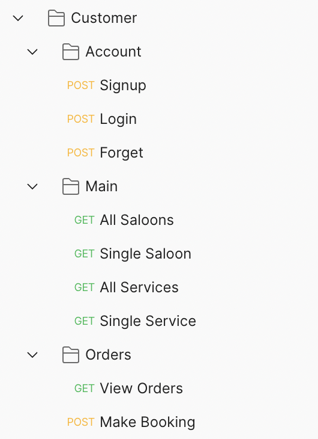
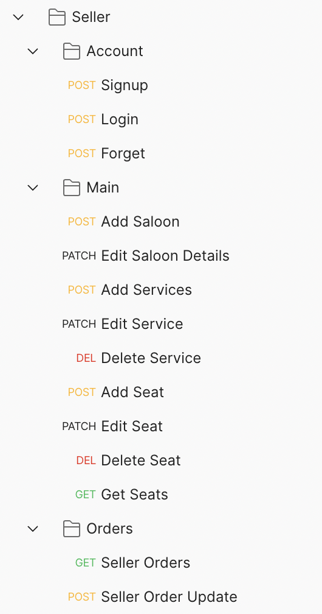
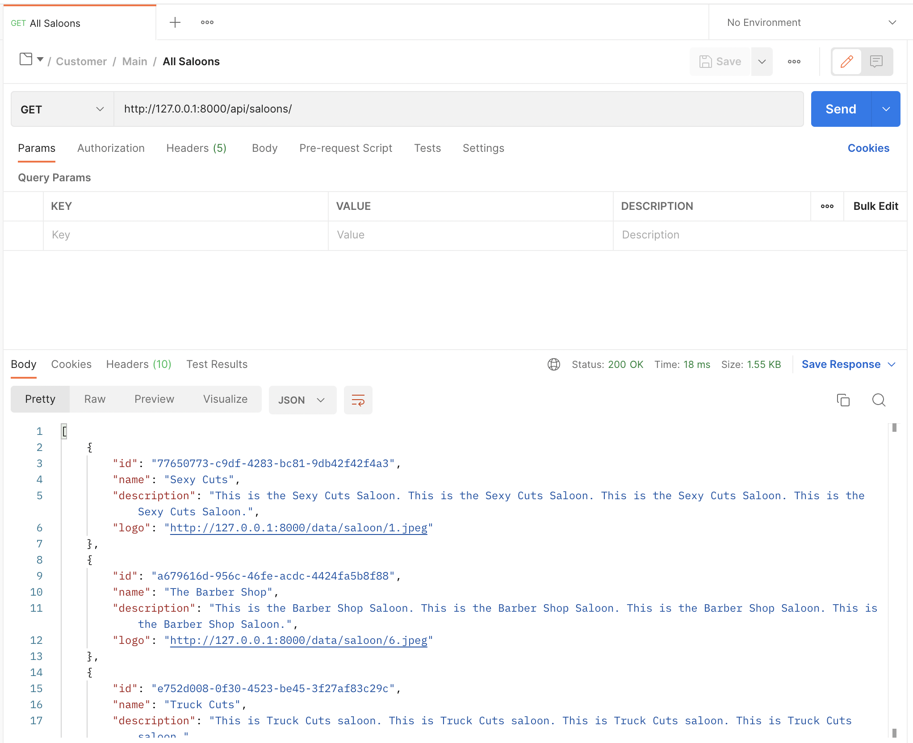
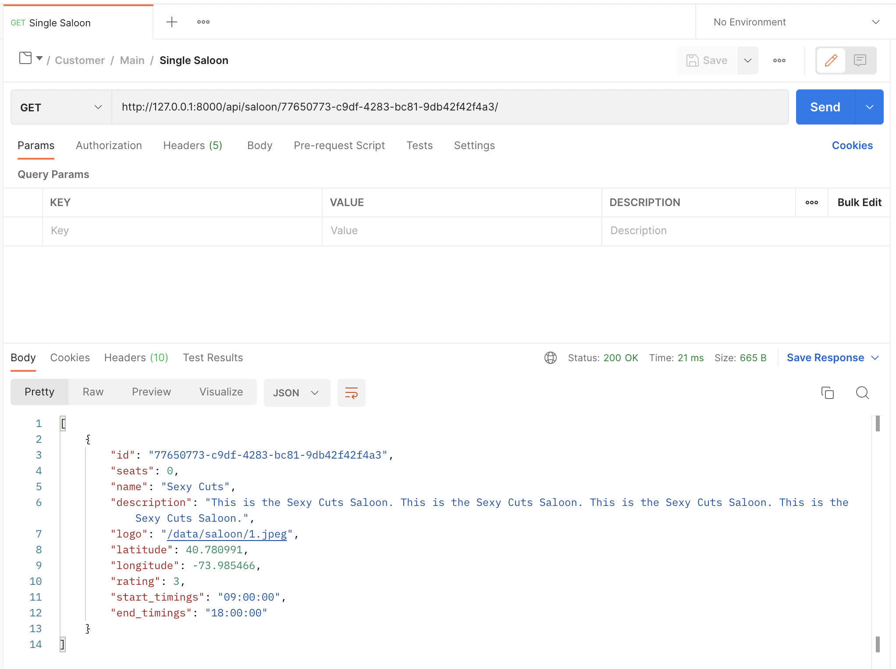
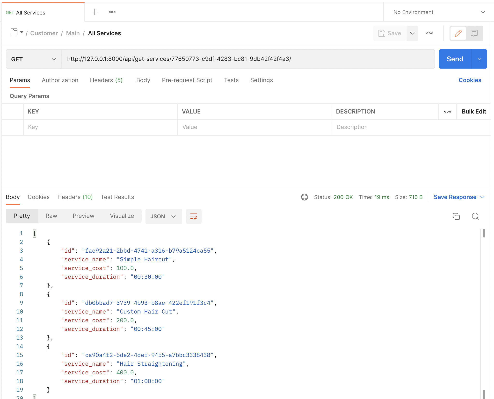
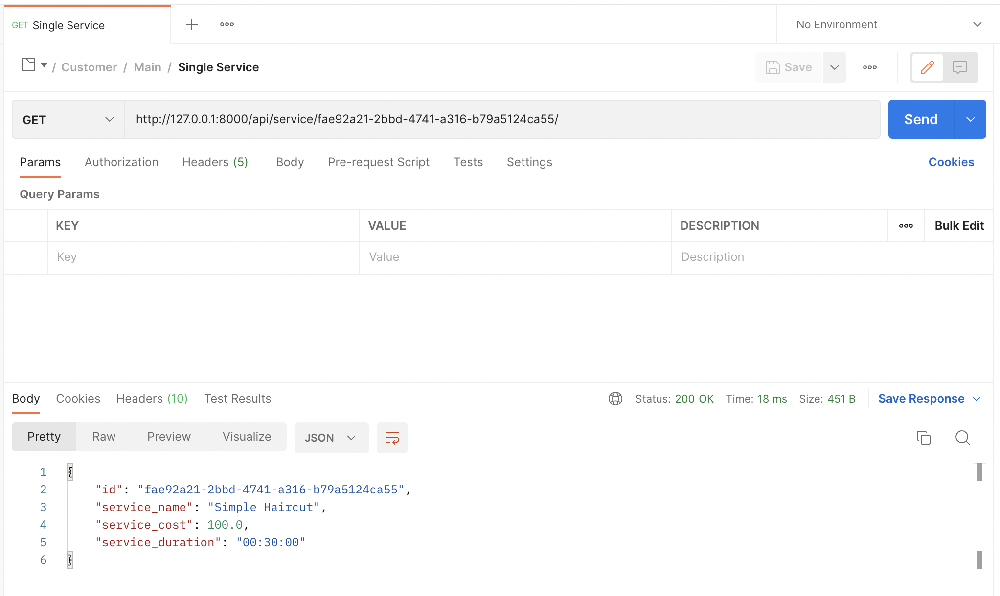
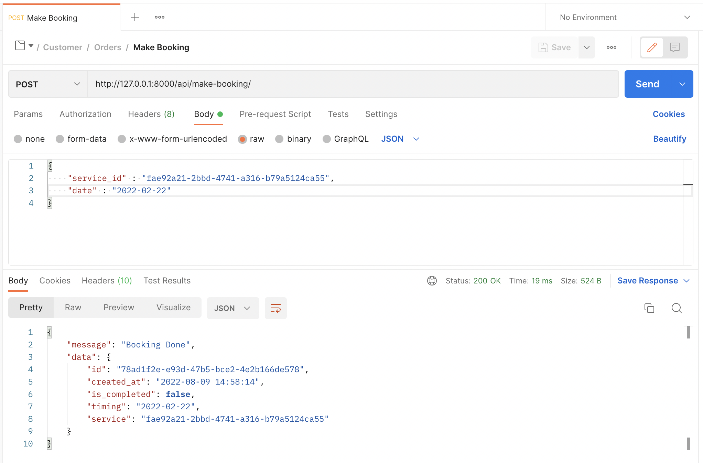
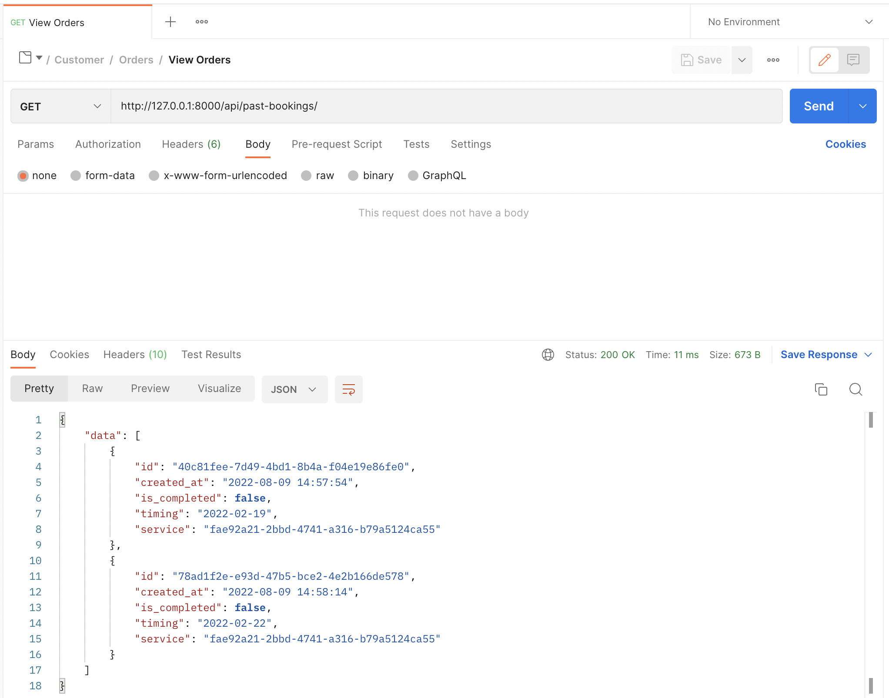

## Saloon Seat Reservation System

The basic aim for implementing Saloon management system is to eliminate the waiting time for the customers at saloon for waiting for their turn for the service. This system would allow customers to view different saloons listed on the application, and view their services offered; also reserve seats for a specific service at any date and time according to their convenience and also pay in advance for the service they which they opted for. The shopkeepers also get an interface to update the seats reservations and their services, also auto-generate invoice for the customers.

**Customer Section** - Customers can create thier profile and log into the application. They can view all the saloons listed on the system and the services they provide. Customers can book slot according to thier convinience. Customers would recieve an automated booking confermation email after boking.

**Seller Section** - Saloon Owners (shopkeepers) can view all bookings. Edit Saloon and Saloon Services details and manage bookings.


### 🔗 Content

* [Overview](#saloon-seat-reservation-system)
* [Content](#-content)
* [Features](#-features)
* [Tech Stack](#-tech-stack)
* [API Reference](#-api-reference)
* [Environment Variables](#-environment-variables)
* [Run Locally](#-run-locally)
* [Documentation](#-documentation)
* [Demo](#-demo)
* [Screen-Shots](#-screen-shots)
* [Author](#-author)


### 📋 Features

- **USER & SELLER AUTHENTICATION :** Users can Signup for a new account, Verify thier email id, Login using email and password, make a Forgot request to reset thier password.

- **SALOONS AND SERVICES :** Users can view all Saloons and Saloon Services listed on the system.

- **REVIEWS AND RATING :** User can add saloon and saloon-services review and rateings.

- **CONTACT US FORM :** User can fill up the Contact Us form. Auto Corrospondence email sending.

- **BOOKING :** User can make booking by selecting time-slots for a perticular service as per users choice.

- **AUTO INVOICE :** After payment, users would recieve invoice (auto-generated) in thier mailbox.


### 🧰 Tech Stack

- **`BACKEND`** : Django *(Python)*

- **`DATABASE`** : SQLite3


### 🛠 API Reference

**Postman Endpoints** : https://www.getpostman.com/collections/1b6a6d804416782baaf1




**API Endpoints JSON file** (for importing into thunderclient / postman) is available in the docs folder or click [here](docs/endpoints.json)


### 🔐 Environment Variables

To run this project, you will need to add the following environment variables to your **.env** file

- `EMAIL_ID`  -  Email ID (which would be used to send emails)

- `EMAIL_PW`  -  Email Password


### 💻 Run Locally

***Step#1 : Clone Project Repository***

```bash
git clone https://github.com/atharvparkhe/saloon-backend.git && cd saloon-backend
```

***Step#2 : Create Virtual Environment***

* If *virtualenv* is not installed :
```bash
pip install virtualenv && virtualenv env
```
* **In Windows :**
```bash
env/Scripts/activate
```
* **In Linux or MacOS :**
```bash
source env/bin/activate
```

***Step#3 : Install Dependencies***

```bash
pip install --upgrade pip -r requirements.txt
```

***Step#4 : Add .env file***

- ENV file contents
    - **In Windows :**
    ```bash
        copy .env.example .env
    ```
    - **In Linux or MacOS :**
    ```bash
        cp .env.example .env
    ```
- Enter Your Credentials in the *".env"* file. Refer [Environment Variables](#-environment-variables)

***Step#5 : Run Server***

```bash
python manage.py runserver
```

*Check the terminal if any error.*


### 📄 Documentation

The docs folder contain all the project documentations and screenshots of the project.

You can read the project report [here](docs/project-report.pdf)

**Local Server Base Link :** http://localhost:8000/

**Deployment Base Link :** https://saloon-backend-django.herokuapp.com/

**Admin Pannel :**
- ***Email :*** "admin@admin.com"
- ***Password :*** "password"

***Frontend IOS App :*** https://github.com/atharvparkhe/saloon-frontend-ios-app

***Frontend Android App :*** https://github.com/atharvparkhe/saloon-frontend-android-app


### 🧑🏻‍💻 Demo

**YouTube Link** : https://youtu.be/GbYhcdAllZ0


### 🌄 Screen-Shots

- **Authentication**


- **Main**





- **Booking**




### 🙋🏻‍♂️ Author

**🤝 Connect with Atharva Parkhe**

[](https://www.linkedin.com/in/atharva-parkhe-3283b2202/)
[](https://www.github.com/atharvparkhe/)
[](https://www.twitter.com/atharvparkhe/)
[](https://www.instagram.com/atharvparkhe/)
[](https://leetcode.com/patharv777/)
[](https://www.youtube.com/channel/UChimOJO64hOqtE7HCgtiIig)
[](https://discord.gg/8WNC43Xsfc)
