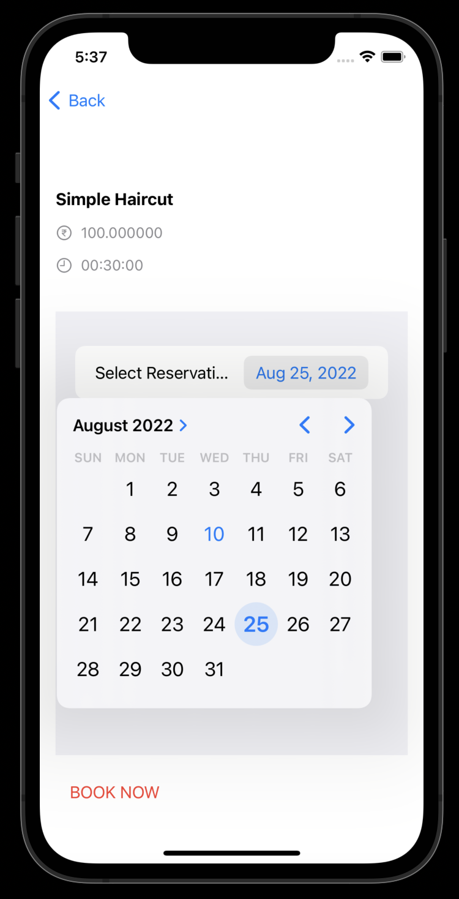

## Saloon Seat Reservation System

The basic aim for implementing Saloon management system is to eliminate the waiting time for the customers at saloon for waiting for their turn for the service. This system would allow customers to view different saloons listed on the application, and view their services offered; also reserve seats for a specific service at any date and time according to their convenience and also pay in advance for the service they which they opted for. The shopkeepers also get an interface to update the seats reservations and their services, also auto-generate invoice for the customers.

Customers can create thier profile and log into the application. They can view all the saloons listed on the system and the services they provide. Customers can book slot according to thier convinience. Customers would recieve an automated booking confermation email after boking.


### 🔗 Content

* [Overview](#saloon-seat-reservation-system)
* [Content](#-content)
* [Features](#-features)
* [Tech Stack](#-tech-stack)
* [Run Locally](#-run-locally)
* [Documentation](#-documentation)
* [Demo](#-demo)
* [Screen-Shots](#-screen-shots)
* [Author](#-author)


### 📋 Features

- **USER & SELLER AUTHENTICATION :** Users can Signup for a new account, Verify thier email id, Login using email and password, make a Forgot request to reset thier password.

- **SALOONS AND SERVICES :** Users can view all Saloons and Saloon Services listed on the system.

- **BOOKING :** User can make booking by selecting time-slots for a perticular service as per users choice.

- **AUTO BOOKING CONFERMATION EMAIL :** After booking, users would recieve booking confermation email (auto-generated) in thier mailbox.


### 🧰 Tech Stack

- **`BACKEND`** : Django *(Python)*

- **`App Logic`** : Swift

- **`App UI`** : Swift UI


### 💻 Run Locally

***Step#1 : Clone Project Repository***

```bash
git clone https://github.com/atharvparkhe/saloon-frontend-ios-app.git && cd saloon-frontend-ios-app
```

***Step#2 : Open folder in Xcode***

***Step#3 : Select any iPhone as simulator***

***Step#3 : Press Build Project Button***


### 📄 Documentation

The docs folder contain all the project documentations and screenshots of the project.

You can read the project report [here](docs/project-report.pdf)

**Backend** : https://github.com/atharvparkhe/saloon-backend


### 🧑🏻‍💻 Demo

**YouTube Link** : https://youtube.com/shorts/9tlJ3EuNdY4?feature=share


### 🌄 Screen-Shots

- **Authentication**


- **Main**


- **Booking**




### 🙋🏻‍♂️ Author

**🤝 Connect with Atharva Parkhe**

[](https://www.linkedin.com/in/atharva-parkhe-3283b2202/)
[](https://www.github.com/atharvparkhe/)
[](https://www.twitter.com/atharvparkhe/)
[](https://www.instagram.com/atharvparkhe/)
[](https://leetcode.com/patharv777/)
[](https://www.youtube.com/channel/UChimOJO64hOqtE7HCgtiIig)
[](https://discord.gg/8WNC43Xsfc)
